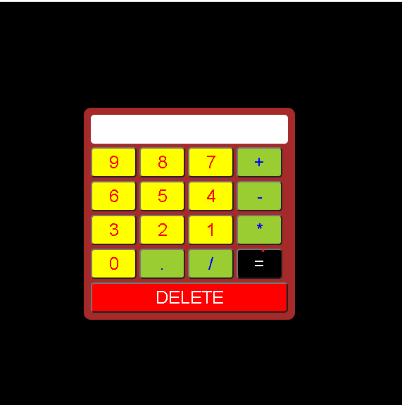
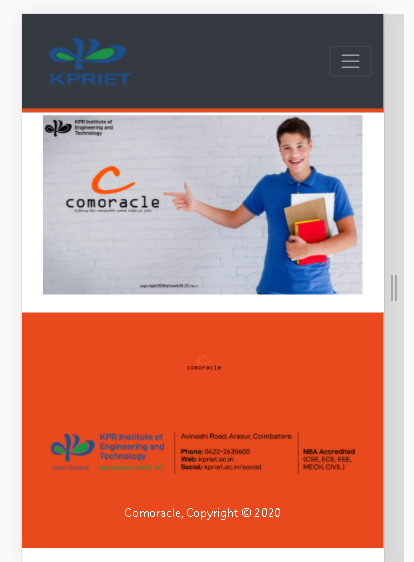
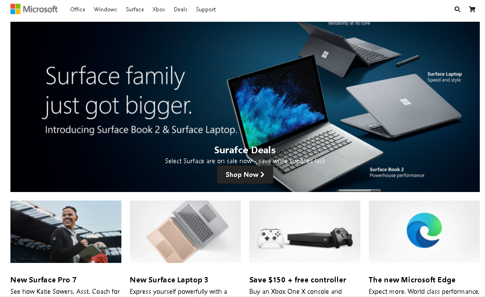
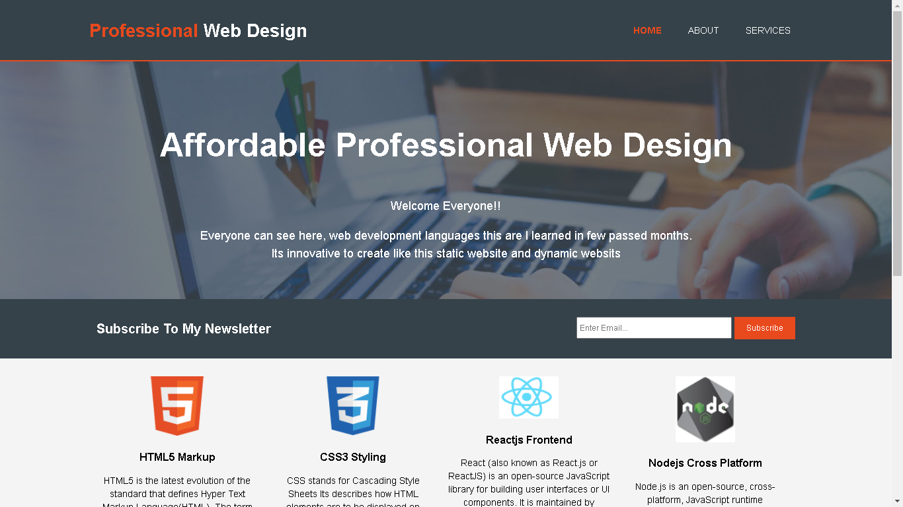

# [My Sample Calculator](https://santheesh16.github.io/Static_Websites/calculator/) :notebook:

   
### My first sample project in *Web development*

  
 

# [College Event Register](https://santheesh16.github.io/Static_Websites/eventproject/) :pencil:

### Event contecting website for students easy access

 

# [Clone Microsoft website](https://santheesh16.github.io/Static_Websites/microsoft/) :file_folder:

 

# [Portfolio](https://santheesh16.github.io/Static_Websites/professional/) :boy:

## Above all websites are using Only 
   * HTML
   * CSS
